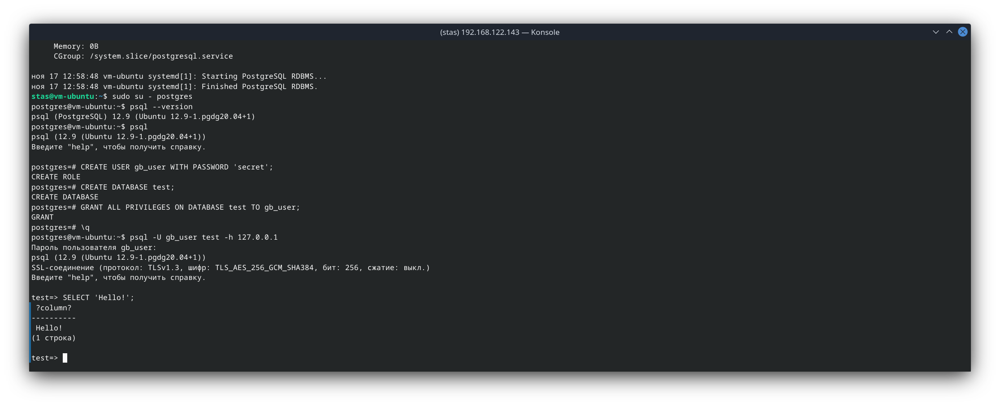
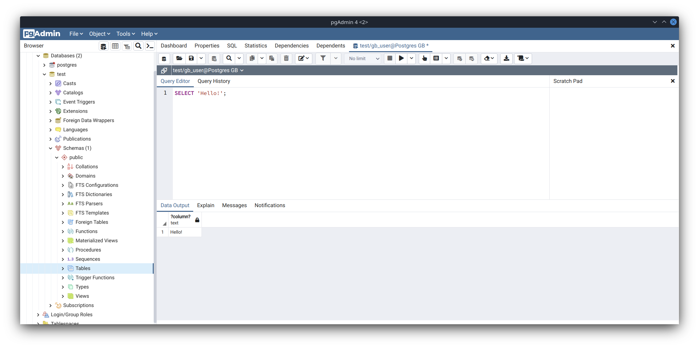
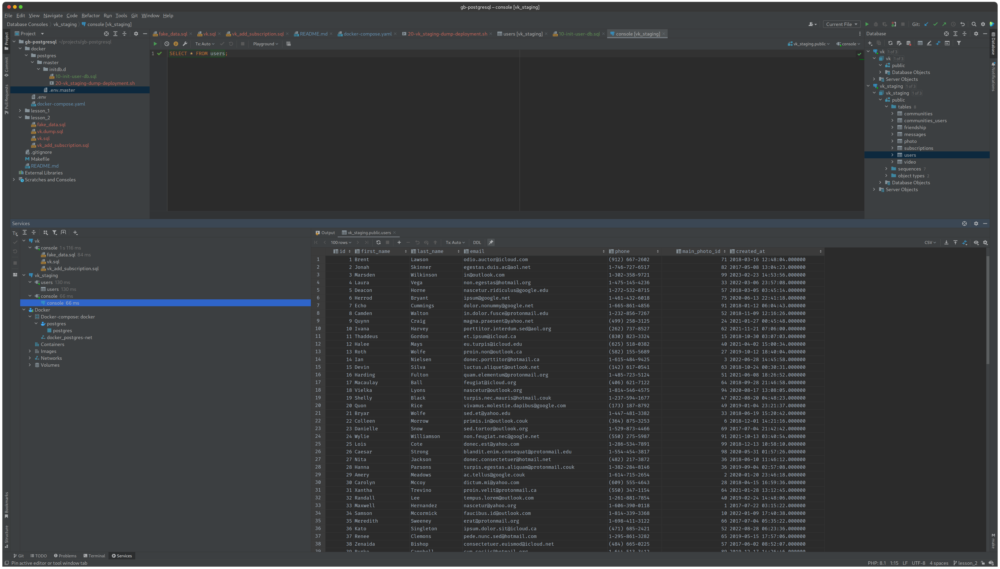
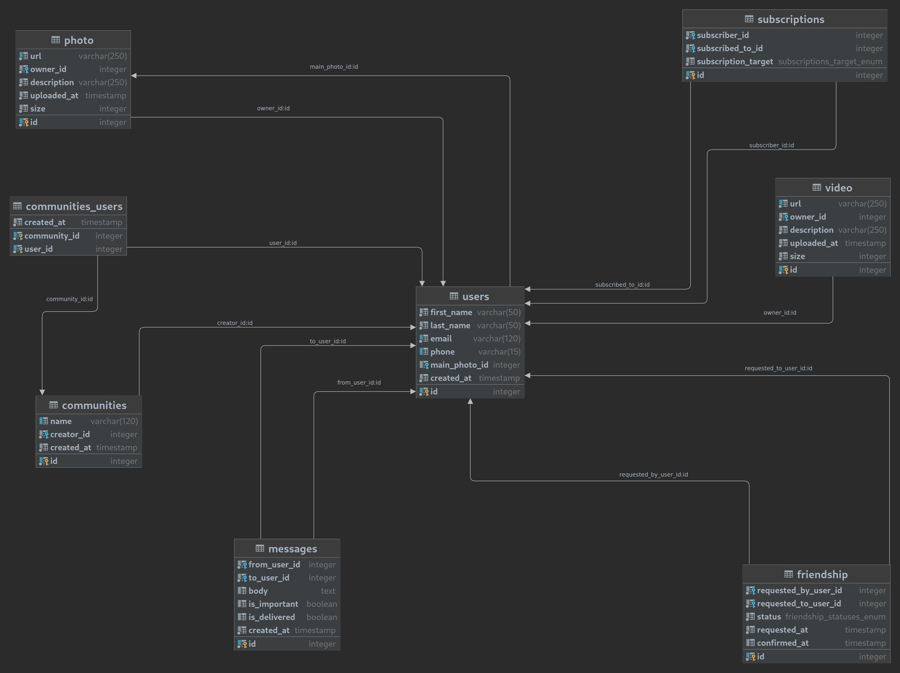

# :mortar_board: Курс [GeekBrains](https://go.redav.online/50829a86237ba651?erid=LdtCKEePH) по PostgreSQL


## :hammer_and_wrench: Установка

### :whale: Запуск приложения в среде [Docker](https://docs.docker.com/engine/install/):
```shell
git clone https://github.com/primetz/gb-postgresql.git && \
cd gb-postgresql && \
make up
```

:closed_lock_with_key: Подключение к БД:
```textmate
Host: localhost
Port: 5432
User: vk_user
Password: secret
Database: vk
```

## :pencil: Практические задания

> ### :one: Возможности объектно-реляционной СУБД PostgreSQL, установка рабочего окружения
>> :pencil2: 1.1 Установить PostgreSQL на виртуальную машину с Linux, настроить подключение консольным клиентом psql.
>>
>> :checkered_flag: Скриншот подключения к виртуальной машине с установленным PostgreSQL по ssh:
>> 
> 
>> :pencil2: 1.2 Установить программу pgAdmin на основную систему и настроить подключение к PostgreSQL на виртуальной машине через туннель SSH.
>>
>> :checkered_flag: Скриншот подключения к виртуальной машине с установленным PostgreSQL из PgAdmin:
>> 

> ### :two: Создание структуры базы данных, генерация тестовых данных
>> :pencil2: 2.1 Создать таблицу для сущности Подписка. Необходимо реализовать возможность подписываться на пользователя или сообщество. Отчет необходимо сдать в виде текстового файла с командой CREATE TABLE.
>>
>> :checkered_flag: Файл с реализацией подписок: [vk_add_subscriptions.sql](./lesson_2/vk_add_subscription.sql)
> 
>> :pencil2: 2.2 Создать тестовые данные для всех таблиц базы данных vk и загрузить эти данные в свою локальную базу данных vk. Отчет необходимо сдать в виде дампа базы данных vk с данными. Для создания дампа используйте команду pg_dump.
>>
>> :checkered_flag: Файл с дампом базы данных vk: [vk.dump.sql](./lesson_2/vk.dump.sql)
> 
>> :pencil2: 2.3 Создать дамп базы данных vk. Создать новую базу данных vk_staging. Загрузить созданный ранее дамп в базу данных vk_staging. Проверить корректность загрузки выполнением SQL запроса
>>
>> :checkered_flag: При запуске приложения `make up` автоматически создается база данных vk_staging и в нее загружается дамп [vk.dump.sql](./lesson_2/vk.dump.sql).
>>
>> 
>>
>> :closed_lock_with_key: Подключение к БД vk_staging:
>> ```textmate
>> Host: localhost
>> Port: 5432
>> User: vk_user
>> Password: secret
>> Database: vk_staging
>> ```

> ### :three: Связность в структуре базы данных, использование сложных и пользовательских типов данных
>> :pencil2: 3.1 Создать все необходимые внешние ключи в базе данных vk. В качестве отчёта сдать команды создания ключей в текстовом виде.
>>
>> :checkered_flag: Файл с реализацией внешних ключей: [vk_db_foreign_keys.sql](./lesson_3/vk_db_foreign_keys.sql)
> 
>> :pencil2: 3.2 Построить диаграмму отношений БД vk, экспортировать ее в изображение и приложить в качестве отчёта.
>>
>> :checkered_flag: ER-диаграмма отношений базы данных vk: [erd-vk-db.png](./lesson_3/erd-vk-db.png)
>>
>> 
> 
>> :pencil2: 3.3 Создать в таблице фотографий столбец metadata типа JSON и следующими ключами - id, url, size и заполнить его значениями соответствующих строк. В отчёт приложить команды ALTER TABLE и UPDATE.
>>
>> :checkered_flag: Файл с реализацией добавления и заполнения столбца metadata: [photo_add_column_metadata.sql](./lesson_3/photo_add_column_metadata.sql)
> 
>> :pencil2: 3.4 В таблице сообществ создать столбец members типа массив. Для сообщества с id = 3 поместить в ячейку members идентификаторы всех пользователей, являющихся членами данной группы. В отчёт приложить выполняемые команды.
>>
>> :checkered_flag: Файл с реализацией добавления и заполнения столбща members: [communities_add_column_members.sql](./lesson_3/communities_add_column_members.sql)
> 
>> :pencil2: 3.5 Создать пользовательский составной тип данных contacts c полями phone и email. В таблице пользователей добавить столбец user_contacts типа contacts. Заполнить столбец значениями из соответствующих строк. Для пользователя с id = 21 изменить email в столбце user_contacts на test@somemail.ru. В отчёт приложить выполненные команды.
>>
>> :checkered_flag: Файл с реализацией добавления столбца user_contacts типа contacts в таблицу users: [users_add_column_contacts.sql](./lesson_3/users_add_column_contacts.sql)
